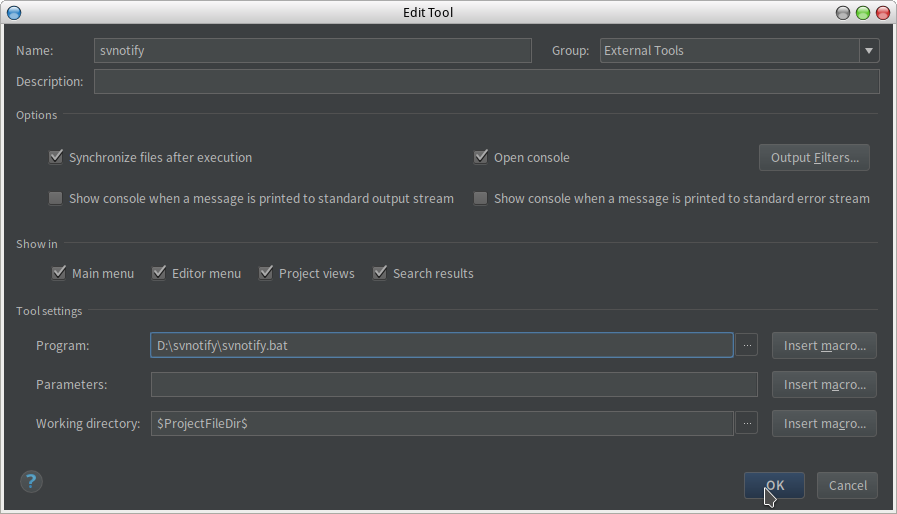

# svnotify

# 1 依赖
* Java Runtime Environment 8
* Apache Subversion 1.9.7

# 2 使用方法
## 2.1 下载
下载[程序](https://github.com/yziyz/svnotify/raw/master/bin/svnotify-1.0.zip)到本地并解压，假定文件夹路径
为`D:\svnotify`；

## 2.2 修改变量

修改`bin/svnotify.bat`的`dingTalkUrl`和`jar文件的路径`，修改后的内容例如：
```
java -jar -DdingTalkUrl=https://oapi.dingtalk.com/robot/send?access_token=x D:\svnotify\svnotify-1.0.jar
```

## 2.2 设置IDEA Intellij
导航至"File > Settings > Tools > External Tools"，点击绿色加号，如图：


填写`Name`为`svnotify`(可为任意值)，`Program`为`D:\svnotify\svnotify.bat`(脚本的路径)，
`Working Directory`为`$ProjectFileDir$`(IDEA内置宏)

> 注：Windows系统的脚本文件需要拓展名`.bat`，类Unix的脚本文件则不需要，为了兼容性，脚本文件命名为`svnotify.bat`



点击`OK`，工具已添加：


## 2.3 使用
提交代码时，在`After Commit`的`Run Tool`中选中我们刚添加的`svnotify`


提交成功后，可在工具控制台查看日志：


Enjoy!

# 2 参考文档

* https://stackoverflow.com/questions/4824590/propagate-all-arguments-in-a-bash-shell-script
* https://www.jetbrains.com/help/idea/commit-changes-dialog.html
* https://en.wikipedia.org/wiki/Batch_file